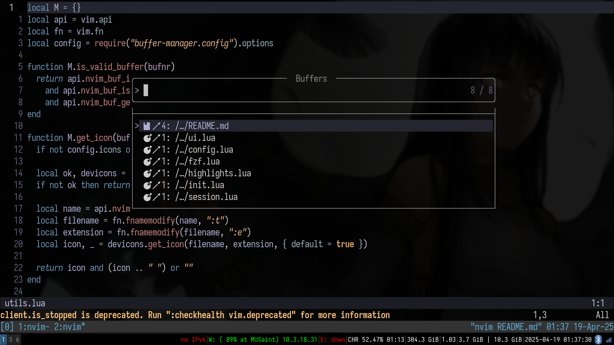
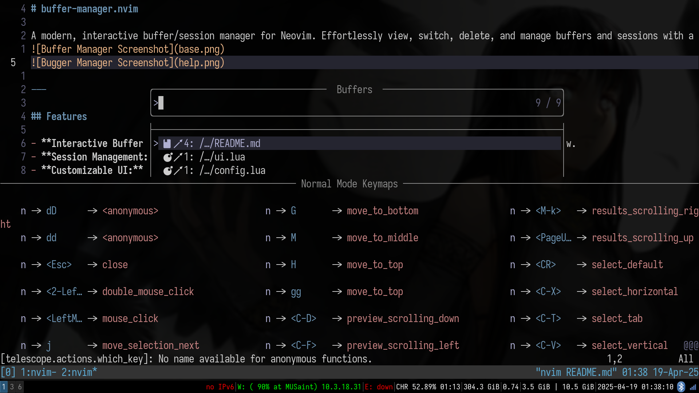

# buffer-manager.nvim

A modern, interactive buffer/session manager for Neovim. Effortlessly view, switch, delete, and manage buffers and sessions with a beautiful UI powered by Telescope and optional FZF integration.



---

## Demonstration

https://user-images.githubusercontent.com/yourusername/demo.gif

Or view the video below:

<video width="480" height="320" controls>
  <source src="buffer-manager.mp4" type="video/mp4">
  Your browser does not support the video tag.
</video>

---

## Features

- **Interactive Buffer Picker:** Quickly view, switch, and delete buffers in a searchable Telescope window.
- **Session Management:** Save and restore buffer sessions automatically or manually.
- **Customizable UI:** Icons, devicons, buffer numbering, and path styles.
- **Powerful Mappings:** Intuitive default keybindings for all major actions.
- **Preview Support:** Optional buffer preview with `lf` or native previewers.
- **FZF Integration:** Use `fzf-lua` for a blazing fast buffer picker (optional).
- **Extensible:** Easily configurable to fit your workflow.

---

## Requirements

- Neovim 0.7+
- [nvim-telescope/telescope.nvim](https://github.com/nvim-telescope/telescope.nvim)
- (Optional) [nvim-tree/nvim-web-devicons](https://github.com/nvim-tree/nvim-web-devicons) for file icons
- (Optional) [ibhagwan/fzf-lua](https://github.com/ibhagwan/fzf-lua) for FZF integration
- (Optional) [gokcehan/lf](https://github.com/gokcehan/lf) for advanced previews

---

## Installation

Using [packer.nvim](https://github.com/wbthomason/packer.nvim):

```lua
use {
  "xsoder/buffer-manager.nvim",
  requires = {
    "nvim-telescope/telescope.nvim",
    "nvim-tree/nvim-web-devicons", -- optional
    "ibhagwan/fzf-lua",            -- optional
  }
}
```

Using [lazy.nvim](https://github.com/srwls/lazy.nvim):

```lua
return {
  "xsoder/buffer-manager.nvim",
  dependencies = {
    "nvim-telescope/telescope.nvim",
    "nvim-tree/nvim-web-devicons", -- optional
    "ibhagwan/fzf-lua",            -- optional
  }
}
```

---

## Usage

### Buffer Picker

Open the buffer manager UI:

```vim
:BufferManager
```

Or use the default mapping:

- `<leader>bb` — Open buffer manager

#### Actions in Buffer Picker

- `<CR>` — Switch to selected buffer
- `dd` or `<C-d>` — Delete selected buffer
- `dD` or `<C-D>` — Force delete selected buffer

### Session Management

- `:BufferManagerSaveSession` — Save current buffer session
- `:BufferManagerLoadSession` — Restore last saved session

Default mappings:

- `<leader>bss` — Save buffer session
- `<leader>bsl` — Load buffer session

---

## Configuration

Call `setup()` in your Neovim config to customize options:

```lua
require("buffer-manager").setup({
  icons = true,
  use_devicons = true,
  default_mappings = true,
  window = {
    width = 0.8,
    height = 0.7,
    border = "rounded",
    preview_width = 0.5,
  },
  style = {
    numbers = "ordinal", -- or "none"
    modified_icon = "●",
    current_icon = "",
    path_style = "shorten", -- "filename", "relative", "absolute", "shorten"
  },
  mappings = {
    open = "<leader>bb",
    vertical = "<leader>bv",
    horizontal = "<leader>bs",
    delete = "<leader>bd",
    delete_force = "<leader>bD",
  },
  sessions = {
    enabled = true,
    auto_save = true,
    session_dir = vim.fn.stdpath("data") .. "/buffer-manager-sessions",
    session_file = "session.json",
    indicator_icon = "󱡅",
  }
})
```

---

## FZF Integration

If you have `fzf-lua` installed and enabled in config, buffer-manager will use it for a faster picker UI.

---

## Previews

Enable advanced previews with the `lf` file manager by setting:

```lua
preview = {
  enabled = true,
  type = "lf", -- or "native"
}
```

---

## Commands

- `:BufferManager` — Open buffer manager UI
- `:BufferManagerSaveSession` — Save buffer session
- `:BufferManagerLoadSession` — Load buffer session

---

## Credits

- Inspired by various buffer/session managers in the Neovim ecosystem.
- Built with [Telescope.nvim](https://github.com/nvim-telescope/telescope.nvim).
- FZF integration via [fzf-lua](https://github.com/ibhagwan/fzf-lua).
- Icons by [nvim-web-devicons](https://github.com/nvim-tree/nvim-web-devicons).

---

## License

This project is licensed under the MIT License. See the [LICENSE](./LICENSE) file for details.

---

## Contributing

Contributions are welcome! Please open issues or pull requests for bugfixes, features, or improvements. Ensure your code is well-documented and tested.

---

## Running Tests

This plugin uses [busted](https://olivinelabs.com/busted/) for tests. To run tests:

1. Install `busted` (e.g. via luarocks: `luarocks install busted`).
2. Run tests from the root directory:

```sh
busted
```

Test files are located in the `test/` directory. Please add tests for new features or bugfixes.
